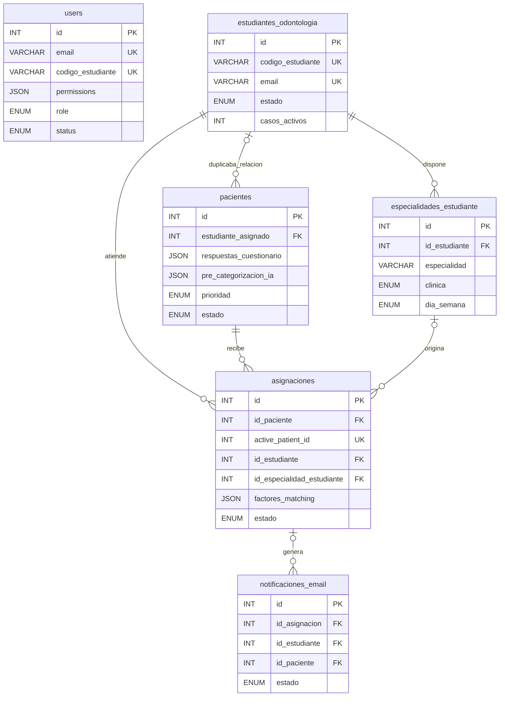
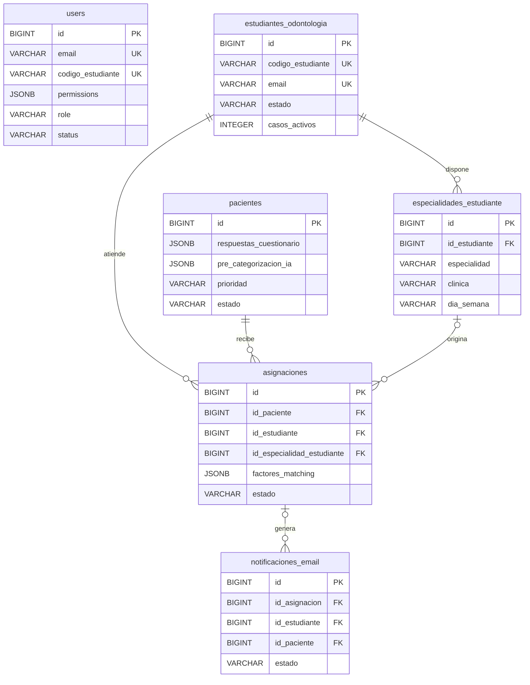

# Migración de base de datos: MySQL a PostgreSQL

## Estado del inventario

El 22 de septiembre de 2026 se inspeccionó directamente, y sin leer datos personales, el volumen local `dental_matching_ia_mysql_data` usado por el contenedor `dental_matching_ia-db-1` del producto principal.

| Tabla MySQL | Filas encontradas |
|---|---:|
| `users` | 0 |
| `estudiantes_odontologia` | 0 |
| `pacientes` | 0 |
| `especialidades_estudiante` | 0 |
| `asignaciones` | 0 |
| `notificaciones_email` | 0 |
| `schema_migrations` | 3 |

El esquema funcional está completo, pero las seis tablas de negocio están vacías. Los tres registros de `schema_migrations` son metadatos de las migraciones MySQL y no se copian: PostgreSQL crea su propio historial de migraciones. No hay actualmente pacientes, estudiantes, usuarios, asignaciones ni notificaciones que puedan perderse durante el cambio.

El comando siguiente permite repetir el inventario en modo de solo lectura y muestra todas las tablas, columnas, tipos y cantidades exactas sin imprimir datos personales:

```powershell
npm run db:inventory:mysql
```

## Esquema anterior (MySQL)



## Esquema final (PostgreSQL)

La base usa el esquema privado `dental_match`. El backend es el único componente que se conecta a ella.



### Tablas y columnas conservadas

| Tabla | Columnas de negocio conservadas |
|---|---|
| `users` | `id`, `email`, `password`, `nombre_completo`, `role`, `permissions`, `codigo_estudiante`, `telefono`, `status`, hashes y fechas |
| `estudiantes_odontologia` | identidad, contacto, universidad, ciudad, año, carga de casos, estado y fechas |
| `pacientes` | identidad, contacto, síntomas, cuestionario, pre-categorización, dolor, disponibilidad, prioridad, consentimiento, estado y fechas |
| `especialidades_estudiante` | estudiante, especialidad, clínica, día, horario, capacidad, estado y fechas |
| `asignaciones` | paciente, estudiante, disponibilidad, cita, especialidad, score, factores, observaciones, estado y fechas clínicas |
| `notificaciones_email` | destinatario, tipo, asunto, mensaje, estado, reintentos, error y fechas |
| `schema_migrations` | se recrea para registrar únicamente las migraciones PostgreSQL |

### Simplificaciones aprobables

| Cambio | Motivo | Pérdida de datos de negocio |
|---|---|---|
| quitar `pacientes.estudiante_asignado` | duplicaba `asignaciones.id_estudiante` y el backend no lo leía | ninguna |
| quitar `asignaciones.active_patient_id` | era una columna derivada usada solo para simular un índice parcial | ninguna |
| índice único parcial por `asignaciones.id_paciente` | impide más de una asignación activa directamente | ninguna |
| `ENUM` a `VARCHAR + CHECK` | reglas explícitas y más fáciles de cambiar | ninguna |
| `JSON` a `JSONB` | tipo nativo indexable de PostgreSQL | ninguna |
| `DATETIME` a `TIMESTAMPTZ` | conserva un instante inequívoco | ninguna |

No se eliminan respuestas clínicas, resultados de pre-categorización, factores del matching, credenciales, historiales ni notificaciones.

## Procedimiento de migración

1. Configurar el origen con `MYSQL_SOURCE_URL` o las variables `MYSQL_SOURCE_*`.
2. Configurar el destino PostgreSQL con `DATABASE_URL` y `DB_SCHEMA=dental_match`.
3. Ejecutar el inventario y revisar cualquier tabla o columna marcada como no copiada.
4. Crear el esquema destino con `npm run migrate`.
5. Copiar y verificar con `npm run db:migrate:mysql`.
6. Ejecutar pruebas funcionales antes de cambiar el backend al destino.
7. Mantener la base MySQL sin modificar hasta completar la aceptación y el respaldo.

La copia aborta si falta una columna requerida, si el destino contiene filas, si existe más de una asignación activa por paciente o si las cantidades finales no coinciden. Toda escritura al destino ocurre en una transacción.

## Comprobación del destino

```sql
SELECT table_name
FROM information_schema.tables
WHERE table_schema = 'dental_match'
ORDER BY table_name;

SELECT 'users' AS tabla, COUNT(*) FROM dental_match.users
UNION ALL SELECT 'estudiantes_odontologia', COUNT(*) FROM dental_match.estudiantes_odontologia
UNION ALL SELECT 'pacientes', COUNT(*) FROM dental_match.pacientes
UNION ALL SELECT 'especialidades_estudiante', COUNT(*) FROM dental_match.especialidades_estudiante
UNION ALL SELECT 'asignaciones', COUNT(*) FROM dental_match.asignaciones
UNION ALL SELECT 'notificaciones_email', COUNT(*) FROM dental_match.notificaciones_email;
```

## Verificación de la implementación

El backend de este repositorio usa PostgreSQL mediante `pg`, el esquema `dental_match` y los repositorios PostgreSQL. Las 49 pruebas automatizadas pasaron. En un PostgreSQL 16 temporal se comprobaron la migración, el alta y login de administrador, el registro de estudiante, el intake de paciente, una asignación y el matching masivo. El agente IA no estaba disponible en esa prueba y se usó el fallback previsto.

El esquema alojado se verificó por separado en el editor SQL: seis tablas de negocio y `schema_migrations`. La prueba de este backend contra esa instancia alojada queda pendiente de configurar `DATABASE_URL` de forma segura.

El matching masivo mantiene un bloqueo de sesión mientras hace consultas por otra conexión; por eso `DB_CONNECTION_LIMIT` debe ser al menos `2` y el pooler, si se usa, debe conservar sesiones.
