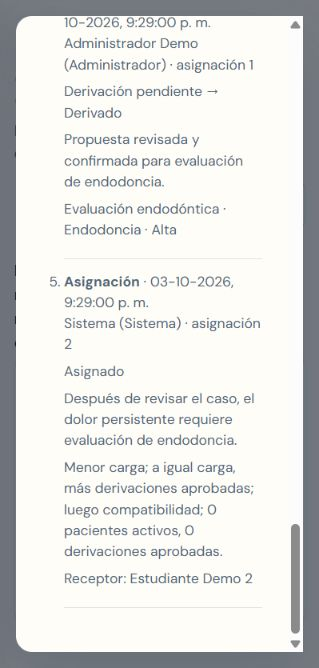

# Seguimiento y derivaciones — Dental Match

Implementación en Capstone, 3 de octubre de 2026. El diseño previo está en [el plan](PLAN_SEGUIMIENTO_DERIVACIONES.md). El repositorio principal y las historias del backlog permanecen sin cambios.

## Qué puede hacer cada rol

| Función | Estudiante | Administrador / coordinador |
|---|---|---|
| Consultar contacto, resumen, cuestionario y clasificación | Sus casos asignados, incluidos los cerrados | Todos los casos |
| Registrar estado y nueva nota con fecha y responsable | Sus asignaciones y transiciones permitidas | Todas las asignaciones y transiciones permitidas |
| Proponer derivación y tratamiento | Después de contactar o durante tratamiento | También puede registrar la propuesta |
| Confirmar/corregir precalificación y revisar derivación | Consulta la revisión | Aprueba, corrige o rechaza con motivo |
| Asignar/reasignar manualmente | — | Candidatos compatibles con cupo; requiere motivo |
| Enviar/reintentar avisos | — | Desde Notificaciones |
| Crear cuentas de personal, cambiar rol o suspender cuenta | — | Solo administrador |

El registro público de estudiantes ya crea su cuenta, perfil, especialidades y horarios. Para dar a una cuenta el rol estudiante debe existir un perfil activo vinculado. La gestión de cuentas nunca permite dejar al sistema sin un administrador activo. Una suspensión o cambio de rol se comprueba en cada petición, incluso si el JWT anterior aún no expiró.

## Flujo de derivación

1. El estudiante contacta y revisa el caso. Escribe tratamiento, especialidad, prioridad y motivo.
2. La asignación pasa a `derivacion_pendiente`; conserva su cupo y admite nuevas notas. No permite otros cambios de estado mientras se revisa.
3. El personal revisa la propuesta. Puede corregir sus campos al aprobarla o rechazarla indicando el motivo.
4. Rechazar restaura el estado anterior sin cambiar la carga. Aprobar cierra el origen como `derivado`, libera un cupo y guarda la clasificación confirmada.
5. El matching busca receptor usando esa clasificación. Si no hay candidato, el paciente queda pendiente y puede volver a procesarse desde Matching o asignarse manualmente desde Pacientes.

Se conserva por separado la sugerencia original y la clasificación revisada. El detalle muestra el estudiante de la asignación consultada y, cuando cambió, el receptor actual.

## Regla de reparto

En pacientes con derivación aprobada se filtran estudiantes con cuenta y perfil activos, ciudad, especialidad, clínica según edad, disponibilidad y capacidad. La preferencia explícita de mañana/tarde se respeta como condición para estos casos. Se considera la ocupación de horarios que se superponen.

Orden de selección: **menos pacientes activos → más derivaciones aprobadas a igual carga → mayor compatibilidad → identificador estable**. Se cuenta cada paciente distinto una vez por estudiante de origen. Pendientes y rechazadas no dan crédito. Un estudiante que ya derivó ese paciente no puede recibirlo nuevamente.

El matching ordinario conserva los pesos 30/25/20/15/5/5. La asignación manual respeta las restricciones de elegibilidad y registra el motivo de la elección. Cada asignación guarda política, carga, créditos y explicación del reparto.

## Historial y concurrencia

Los registros de caso, cambios de estado, notas, revisiones, derivaciones, reasignaciones y avisos agregan eventos con responsable, rol y fecha. El historial rechaza `UPDATE` y `DELETE` mediante un trigger. La última nota se conserva también en la asignación; las notas anteriores siguen en los eventos.

La migración incorpora un punto de partida para las asignaciones existentes. No reconstruye cambios anteriores que el sistema no guardaba. Los cambios de asignación y derivación se serializan mediante un bloqueo transaccional de operación, además del bloqueo del paciente y de los estudiantes. Una restricción única impide tener dos asignaciones activas por paciente. La carga real se vuelve a contar después de adquirir el bloqueo del estudiante.

## Activación

Con las variables de la base objetivo configuradas y un respaldo disponible:

```powershell
npm run migrate
npm run migrate:status
npm --prefix client run build
npm start
```

La migración nueva es `20261003000001_case_followup_and_referrals.js`. Durante esta implementación se aplicó y verificó únicamente en PostgreSQL local con datos sintéticos. La compilación del frontend es necesaria para que Express sirva las pantallas nuevas desde `client/dist`.

### Instalación local de pruebas — 5 de octubre de 2026

Se preparó el archivo `.env` local, excluido de Git, y se creó la base `dental_match_capstone_test` en PostgreSQL del PC (`127.0.0.1:5432`), con esquema `dental_match`. La conexión local utiliza el usuario `postgres`; las contraseñas y los secretos de sesión se conservan únicamente en `.env`.

Las dos migraciones se ejecutaron correctamente. `npm run migrate:status` confirmó dos disponibles, dos ejecutadas y cero pendientes. La API de salud confirmó PostgreSQL disponible y el frontend respondió con HTML, ambos con HTTP 200. Las 16 pruebas de integración de PostgreSQL pasaron usando esta instalación; sus esquemas temporales se eliminaron al terminar.

Se creó un administrador de pruebas llamado Carlos Avello. Su email está en `ADMIN_EMAIL` y su contraseña en `ADMIN_PASSWORD` del `.env`. Se verificaron el login, el perfil, la gestión de cuentas y el dashboard con HTTP 200. El frontend se compiló nuevamente.

Para iniciar esta instalación:

```powershell
npm start
```

Abrir `http://127.0.0.1:3000`. La base es nueva para pruebas; no contiene pacientes ni estudiantes previos. Para producción se deberá configurar la conexión a la base en la nube en ese entorno, ejecutar sus migraciones y configurar el proveedor de correo.

## Correo

Configurar `RESEND_API_KEY`, `EMAIL_FROM` (remitente verificado) y `EMAIL_INSTANCE_ID` (identificador estable y distinto por entorno/base). No cambiar el identificador entre reintentos.

```powershell
npm run worker:email          # proceso continuo, separado del servidor web
npm run worker:email -- --once # procesar un lote y salir
```

El trabajador reclama avisos exclusivamente, conserva el payload del primer intento y reintenta hasta cinco veces con espera creciente. El personal también puede enviar o reintentar desde la interfaz. Los avisos de asignaciones ya cerradas se omiten. `enviado` significa que el proveedor aceptó el mensaje; no confirma entrega o lectura.

Los reintentos usan una clave de idempotencia. Resend conserva estas claves durante 24 horas; por eso un envío incierto de más de 23 horas se bloquea para revisión en el proveedor y evita un reenvío automático duplicado. [Documentación oficial de idempotencia](https://resend.com/docs/dashboard/emails/idempotency-keys), [API de envío](https://resend.com/docs/api-reference/emails/send-email).

El envío real requiere configurar el proveedor. Las pruebas usaron respuestas simuladas y no enviaron mensajes externos.

## Timeout del agente

`AI_AGENT_TIMEOUT_MS` vale 20 segundos por defecto, con máximo de 50 segundos. El adaptador devuelve fallback ante aborto, error de red o respuesta no exitosa; el servicio de ingreso también tolera errores del puerto de IA. El timeout del servidor web conserva al menos 15 segundos adicionales para registrar el paciente y responder.

## Verificación reproducible

```powershell
npm run lint
npm test -- --runInBand
npm --prefix client run lint
npm --prefix client run build
# URL local explícita; el test crea y elimina exclusivamente su propio esquema.
$env:TEST_DATABASE_URL = 'postgres://usuario@127.0.0.1:5432/base_de_prueba'
npm run test:postgres
npm run test:coverage -- --runInBand
```

La suite normal omite las pruebas de PostgreSQL cuando falta `TEST_DATABASE_URL`. `test:postgres` exige la variable y rechaza servidores remotos. El test utiliza un esquema aleatorio, migra desde cero, verifica una segunda ejecución sin pendientes y elimina su esquema al terminar.

Se probaron simultaneidad de matching y aprobación, notas inmutables, permisos de casos, validación de derivación, falta de receptor, reasignación y cargas, clasificación original frente a corregida, suspensión y roles vigentes, protección del último administrador, reclamo de correo exclusivo, confirmación, fallos y reintentos, reclamo vencido, aviso obsoleto, y alta HTTP después de un `AbortError`.

Resultado final: **86 pruebas aprobadas**, incluidas **16 con PostgreSQL real**. Lint de backend y frontend, build del frontend y `git diff --check` correctos. La cobertura del núcleo configurado en Jest fue 93,68 % de sentencias, 88,35 % de ramas, 92 % de funciones y 96,98 % de líneas. Ese alcance de cobertura no incluye todos los archivos de la aplicación.

La revisión de interfaz recorrió administrador → asignación manual → estudiante → contacto y nota → propuesta → administrador → aprobación → nuevo receptor, además de las pantallas de cuentas y notificaciones. Se comprobó el diálogo en una ventana estrecha y se corrigió su desplazamiento. Sin errores de consola durante la revisión final. Agent-browser no pudo iniciar Chrome en este entorno; se utilizó el navegador integrado.



## Verificación de rutas de producción en Vercel

Fecha: 5 de octubre de 2026. Los despliegues de frontend y API corresponden al repositorio Capstone, rama `main`, commit `5fcfffb`.

La hipótesis inicial de que el frontend no llegaba a la API se descartó mediante solicitudes HTTP directas. El navegador de pruebas mostraba `ERR_BLOCKED_BY_CLIENT`, pero los dominios de producción respondieron sin sesión de Vercel ni mecanismos de bypass. Ese bloqueo de la herramienta no demuestra una falla de la aplicación.

El proyecto `dental-match-web` ya tiene una regla manual activa en Vercel: `/api/:path*` se dirige a `https://dental-match-api.vercel.app/api/$1`. Esa configuración explica por qué producción funciona aunque `client/vercel.json` solo tuviera el fallback de la SPA.

Se incorporó la ruta equivalente a `client/vercel.json`, antes de `/index.html`, para que la conexión quede respaldada en Git y pueda reproducirse al desplegar. El cliente conserva `/api` y las cookies del mismo sitio. No requiere una URL pública nueva en las variables del frontend ni cambios en CORS o en las cookies. La regla manual de Vercel tiene precedencia y ya apunta al mismo destino; no es necesario modificarla para publicar este cambio. [Rewrites de Vercel](https://vercel.com/docs/routing/rewrites).

También se corrigió el cliente compartido: antes aceptaba HTML o JSON inválido con HTTP 200 como un objeto vacío. Ahora muestra: «No se pudo obtener una respuesta válida de Dental Match. Intenta nuevamente». Los mensajes JSON del backend y la renovación de sesión se conservan.

Comprobaciones HTTP realizadas sobre la producción existente, antes de publicar esta corrección:

| Consulta | Resultado |
| --- | --- |
| Web `/`, `/login` y `/landing` | HTTP 200, HTML de la SPA |
| Web `/api` y `/api/info` | HTTP 200, JSON del backend |
| Web y API `/api/health` | HTTP 200, PostgreSQL saludable |
| Web `/api/auth/validate-token`, `/api/pacientes`, `/api/derivaciones` y `/api/users` sin sesión | HTTP 401, JSON |
| Web `/api/__e2e_ruta_inexistente__` | HTTP 404, JSON |
| Web `POST /api/auth/login` con `{}` | HTTP 400, `VALIDATION_ERROR` |
| Web `POST /api/auth/refresh-token` con `{}` | HTTP 401, `AUTHENTICATION_ERROR` |
| Agente IA `/health` | HTTP 200, estado `ok` |

La validación local del cambio pasó: siete pruebas nuevas del cliente, doce pruebas existentes del contrato HTTP del backend, lint y build del cliente. Las pruebas detectaron tres fallos antes de la corrección: ruta API ausente del archivo y aceptación de HTML y JSON incompleto como éxito. Después de la corrección, las siete pasaron. Vite mantiene el aviso previo de un bundle mayor de 500 kB; la compilación finaliza correctamente.

```powershell
npm --prefix client test
npm --prefix client run lint
npm --prefix client run build
npm test -- --runInBand tests/integration/api.test.js
```

Estas comprobaciones no crearon pacientes, no modificaron cuentas ni enviaron correos. El E2E de producción con sesiones de administrador y estudiante, operaciones de derivación y envío real de correo sigue pendiente. El cambio preparado para commit no necesita una migración de base de datos. Después del commit y push desde GitHub Desktop, comprobar el despliegue nuevo y ejecutar el E2E con acceso autorizado a las cuentas de prueba.


## Verificación adicional — 5 de octubre de 2026

El corte más reciente agrega el alta de estudiante desde el panel y CI. Se ejecutaron 89/89 pruebas Jest (19 PostgreSQL), siete pruebas del cliente, nueve escenarios de navegador y un flujo HTTP completo hasta completado. El E2E de navegador incluye crear/asignar al paciente, proponer/aprobar su derivación y completar el tratamiento desde la cuenta del receptor; historial y cupos comprobados en PostgreSQL. Rendimiento/estrés local y seguridad están documentados en [pruebas y CI](PRUEBAS_Y_CI.md), con resultados JSON y capturas. Este corte complementa las cifras históricas anteriores. UAT humana, piloto desplegado y primer run de GitHub quedan pendientes.

El [recorrido exploratorio local](E2E_EXPLORATORIO_LOCAL.md) complementa las suites con navegación adaptativa de un agente por las pantallas del personal, estudiante y público, además de la vista móvil. Confirmó el cierre del caso, la persistencia del historial y el reintento de una derivación sin receptor al liberar capacidad. Se corrigió el nombre visible de la portada y el registro del paciente; quedan observaciones de claridad sobre cupos por horario y cancelación de asignaciones.
